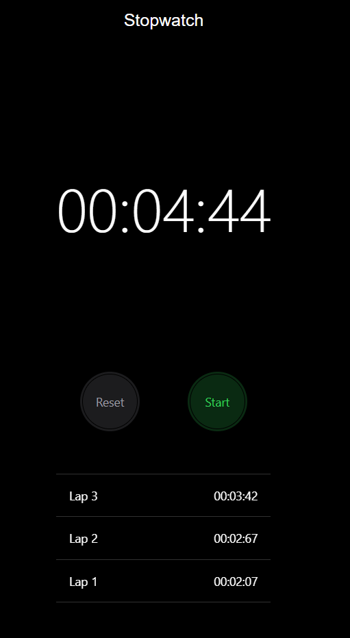

# Stopwatch app  
## By V.S.Sai Rashwant(20BCE1332) & B.ARUN PRASATH(20BRS1080)  
	
Application Design:  
	We are making a stopwatch application using react native expo.  
	We have 5 components.  
		Control  
		Header  
		Result  
		Stopwatch  
		Utility  
We divided whole app into 5 components.  
Control: This component defines how the buttons will work when the clock is running and when the clock is not not running.  
Header: This component defines how the Stop watch logo will look.  
Result: This component takes care of calculating how the clock should run and how the result has to be calculated.  
Stopwatch: This component combines everyother component, and uses it develor the ui of the stopwatch app.  
Utility: This defines on how the numbers should display on the screen.  
Contributions:  
Arun Prasath did Control and Header part.  
Sai Rashwant did Result, stopwatch and utility.  
Screenshots:  
 
